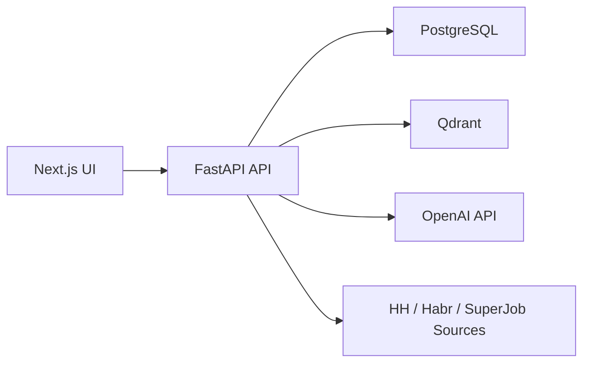

# HR Assist

Платформа для анализа резюме и интеллектуального подбора вакансий.

## Что уже готово

- Личный кабинет на Next.js.
- Backend на FastAPI + PostgreSQL.
- Загрузка PDF/DOCX и структурный анализ резюме через OpenAI.
- Семантический поиск и хранение эмбеддингов в Qdrant.
- Фоновое наполнение вакансий.
- Защищенная авторизация: beta-key + подтверждение email + код входа.
- Базовая защита от prompt-injection в LLM-контурах.

## Архитектура



Подробности: [docs/ARCHITECTURE.md](docs/ARCHITECTURE.md)

## Быстрый старт

1. Скопируйте env:

```powershell
Copy-Item .env.example .env.local
```

2. Заполните минимум в `.env.local`:

```env
OPENAI_API_KEY=sk-...
JWT_SECRET_KEY=replace-with-strong-secret
BETA_TESTER_KEYS=your-beta-key-1,your-beta-key-2
AUTH_EMAIL_DELIVERY_MODE=console
```

3. Запустите сервисы:

```powershell
docker compose up -d --build
```

4. Откройте:

- UI: [http://localhost:3000](http://localhost:3000)
- API docs: [http://localhost:8000/docs](http://localhost:8000/docs)
- Health: [http://localhost:8000/health](http://localhost:8000/health)
- Config check: [http://localhost:8000/api/system/config-check](http://localhost:8000/api/system/config-check)
- Qdrant: [http://localhost:6333/dashboard](http://localhost:6333/dashboard)

## Как работает вход

1. Регистрация: email + пароль + beta-key.
2. Подтверждение email одноразовым кодом.
3. Вход: `login/start` (email+пароль), затем `login/verify` (код+challenge).
4. Защищенные API доступны только после подтверждения email.

## Ключевые переменные окружения

Полный список: [.env.example](.env.example)

- `OPENAI_API_KEY` - ключ OpenAI.
- `OPENAI_ANALYSIS_MODEL` - модель анализа резюме/вакансий.
- `OPENAI_MATCHING_MODEL` - модель детального matching.
- `JWT_SECRET_KEY` - секрет подписи JWT.
- `BETA_TESTER_KEYS` - список разрешенных ключей бета-тестеров.
- `AUTH_EMAIL_DELIVERY_MODE` - `console` для локалки, `smtp` для прода.
- `DATABASE_URL` - подключение к PostgreSQL.
- `QDRANT_URL` - адрес Qdrant.

## Безопасность

- Не коммитьте `.env.local`.
- Не храните реальные токены/секреты в репозитории.
- Для production используйте только SMTP-режим отправки кодов.
- Пожалуйста, сообщайте уязвимости приватно: [SECURITY.md](SECURITY.md)

## Планы развития

Полный публичный roadmap: [docs/ROADMAP.md](docs/ROADMAP.md).

Сейчас готовимся к **Phase 2** (Retention): дайджесты и проактивные уведомления по новым подходящим вакансиям. Качество подбора и мульти-профиль уже в проде — см. релиз `v0.3.0`.

Недавние релизы:

- `v0.3.0` — Phase 1.7 (Matching quality + multi-profile): skill-overlap floor, штраф за грейд, обновлённый title boost, гигиена индекса, time-decay предпочтений, до 2 профилей-резюме с изолированным фидбэком и бейджами на Kanban.
- `v0.2.0` — Phase 1 (Actionability): предпочтения при поиске, объяснение совпадений, трекер откликов, AI-сопроводительные, отмена подбора.
- `v0.1.0` — Phase 0 (Foundation): бюджет-гард на OpenAI, структурные логи, rate-limit на auth, SMTP-доставка кодов.

> Версия намеренно меньше 1.0 — продукт в закрытой бете, публичный запуск состоится позже.

## Вклад в проект

Правила для контрибьюторов: [CONTRIBUTING.md](CONTRIBUTING.md)
