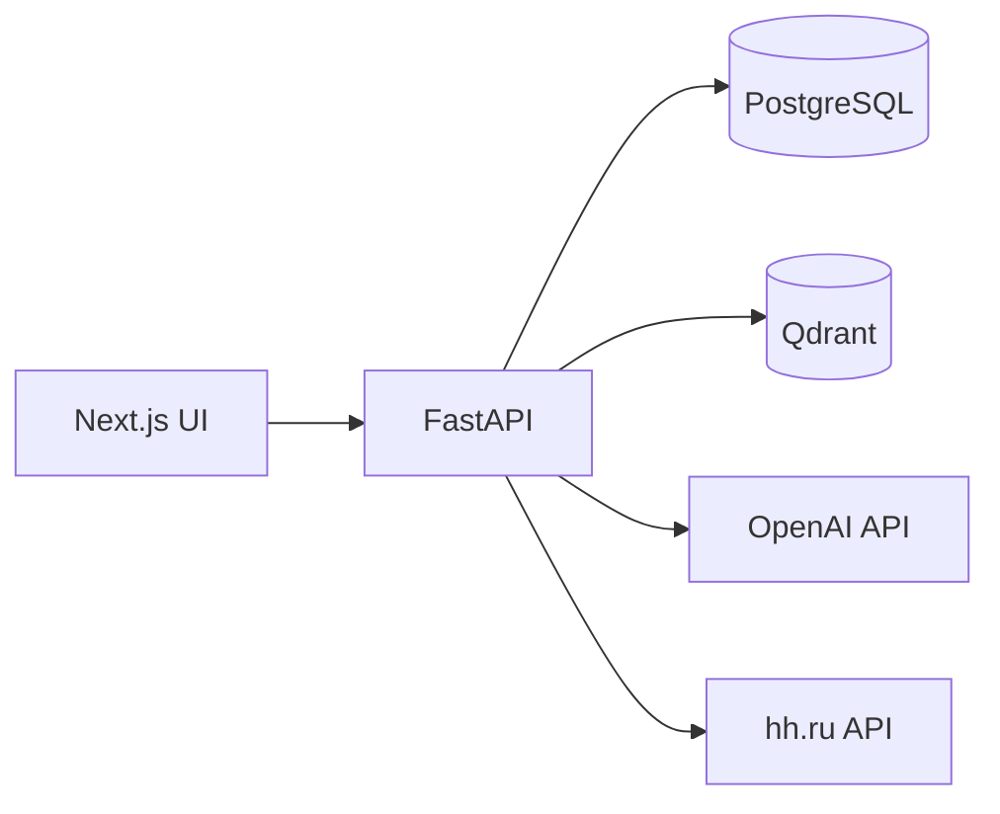

# HR Assist

**AI-assisted resume intelligence and job matching platform.**

> Upload a resume — get a structured candidate profile, a ranked shortlist of real vacancies, a per-vacancy "why shown" explanation, and a gap analysis of the skills you are missing. Feedback on each vacancy (shortlist / blacklist / like / dislike) is time-decayed and fed back into ranking.

> Russian version: [README.ru.md](README.ru.md).

---

## Overview

HR Assist is an end-to-end system for jobseekers. A user uploads a PDF or DOCX resume; the platform extracts text, runs a structured LLM analysis, infers an approximate seniority grade, pulls live vacancies from the hh.ru API, embeds both sides into Qdrant, and ranks the results with a multi-stage semantic matcher. For every vacancy the user sees why it was recommended and which skills are missing to reach the bar. Shortlist, blacklist, like and dislike signals are weighted by time decay and feed back into future ranking.

The platform runs locally on Docker Compose and is deployed to a dedicated server for closed-beta use.

## Value proposition

- **For the jobseeker:** turns a raw resume into a ranked, explained shortlist of real vacancies — instead of keyword search on job boards.
- **For the hiring manager reading this repo:** a full-stack AI product that treats matching as a search / retrieval problem with an eval bar in CI, not a single embedding-similarity call behind a UI.

## Key features

| | |
|---|---|
| **Resume parsing** | PDF/DOCX → plain text → structured profile (role, grade, hard/soft skills, domains, experience). |
| **AI resume analysis** | LLM breakdown: strengths, growth zones, risks, concrete improvement suggestions. |
| **Skill extraction & grade inference** | Normalised against an RU↔EN skill taxonomy with ESCO-based role classification. |
| **Semantic vacancy matching** | Qdrant vector index plus a multi-stage matcher: pre-filter, domain gate, skill-overlap floor, MMR diversity, cross-encoder / LLM rerank. |
| **Gap analysis** | Per-vacancy "why shown" and the exact skills the user is missing. |
| **Feedback loop** | Shortlist / blacklist / like / dislike, weighted by time decay, influence future ranking. |
| **Application tracker** | Kanban flow (Applied → Replied → Interviewing → Rejected) with AI-generated cover letters. |
| **Vacancy sourcing** | Live hh.ru API fetch into an internal vacancy index, parallelised with LLM parsing. Additional source adapters (SuperJob, Habr Career) are present in the code but off by default. |
| **Preference profile** | Work format, relocation, target roles, salary — stored per user and factored into ranking. |
| **Admin panel** | User management, funnel telemetry, technical statistics. |

## How it works

```
Upload resume (PDF/DOCX)
        ↓
Extract text (pypdf / python-docx)
        ↓
Structured LLM analysis (role, grade, skills, domains)
        ↓
Embed resume profile → Qdrant
        ↓
Fetch live vacancies (hh.ru API) → embed → Qdrant
        ↓
Multi-stage semantic matching (domain gate, skill floor, MMR, rerank)
        ↓
Ranked shortlist with "why shown" + missing-skills explanation
        ↓
User feedback (shortlist / blacklist / like / dislike)
        ↓
Feedback decayed over time, fed back into ranking
```

## Architecture



Three stateful stores, one application boundary:

- **PostgreSQL** — source of truth for users, resumes, vacancies, applications, feedback, telemetry.
- **Qdrant** — dense vector store for resume and vacancy embeddings.
- **OpenAI** — LLM analysis and embeddings; a local cross-encoder handles rerank.
- **FastAPI** owns all business logic; the Next.js frontend is a thin UI layer over the REST API.

Deeper dive: [`docs/ARCHITECTURE.md`](docs/ARCHITECTURE.md). Rerank notes: [`docs/RERANK.md`](docs/RERANK.md). ESCO role classification: [`docs/ESCO.md`](docs/ESCO.md).

## Tech stack

- **Backend:** FastAPI, SQLAlchemy 2, Alembic, Pydantic, slowapi
- **AI layer:** OpenAI (analysis + embeddings), sentence-transformers (local cross-encoder rerank)
- **Data:** PostgreSQL 16, Qdrant 1.13
- **Frontend:** Next.js 16, React 19, TypeScript, Tailwind v4, shadcn/ui, Radix
- **Infra:** Docker Compose, GitHub Actions CI, SSH-based CD
- **Auth:** JWT + email OTP + beta-key gate

## Running locally

```bash
cp .env.example .env.local
# Fill in at least OPENAI_API_KEY, JWT_SECRET_KEY, BETA_TESTER_KEYS
# Leave AUTH_EMAIL_DELIVERY_MODE=console to read OTP codes from backend logs.

docker compose up -d --build
```

Services:

- UI — http://localhost:3000
- API docs — http://localhost:8000/docs
- Health — http://localhost:8000/health
- Qdrant dashboard — http://localhost:6333/dashboard

Alembic migrations run automatically when the backend container starts.

## Environment variables

Full reference: [`.env.example`](.env.example). Minimum to run:

| Variable | Purpose |
|---|---|
| `OPENAI_API_KEY` | LLM + embeddings |
| `OPENAI_ANALYSIS_MODEL` | Model used for resume / vacancy analysis |
| `OPENAI_MATCHING_MODEL` | Model used for detailed matching + rerank |
| `OPENAI_EMBEDDING_MODEL` | Embedding model (defaults to `text-embedding-3-large`) |
| `JWT_SECRET_KEY` | JWT signing secret |
| `BETA_TESTER_KEYS` | Comma-separated list of accepted beta keys |
| `AUTH_EMAIL_DELIVERY_MODE` | `console` for local dev, `smtp` for production |
| `DATABASE_URL` | PostgreSQL connection string |
| `QDRANT_URL` | Qdrant endpoint |
| `OPENAI_REQUEST_BUDGET_USD` | Per-request spend cap (enforced when `OPENAI_ENFORCE_REQUEST_BUDGET=true`) |

Optional source adapters (`HH_API_TOKEN`, `SUPERJOB_API_KEY`, `HABR_CAREER_API_TOKEN`, `BRAVE_API_KEY`) can be left empty — the platform works against public hh.ru endpoints without them.

## API / system notes

- **Auth flow:** register → verify email → `POST /api/auth/login/start` (email + password) → `POST /api/auth/login/verify` (OTP + challenge). Protected endpoints require a verified email.
- **Rate limiting:** slowapi on auth endpoints to contain brute-force.
- **Prompt-injection guard:** untrusted resume and vacancy text is sanitised before being handed to the LLM (`app/services/llm_guard.py`).
- **Cost guard:** per-user daily OpenAI spend budget stops runaway usage (`app/models/user_daily_spend.py`).
- **Observability:** structured logs, impression / click / dwell telemetry on matching results (`app/services/match_telemetry.py`).
- **Matching eval harness:** labelled gold pairs with NDCG / MAP / MRR floors enforced in CI (`backend/tests/test_matching_eval_*`).

## Current status

Closed-beta MVP. The end-to-end flow runs in production on a dedicated server.

### What works now

- Registration + email-OTP auth behind a beta-key gate
- PDF / DOCX upload, parse, structured LLM analysis, skill and grade extraction
- Live hh.ru fetch, embed, Qdrant index
- Multi-stage semantic matching with "why shown" and missing-skills explanation
- Shortlist / blacklist / like / dislike with time-decayed influence on ranking
- Application tracker (Kanban) with AI-generated cover letters
- Admin panel, user preference profile, funnel telemetry
- Docker Compose local stack, GitHub Actions CI, SSH-based CD to production

### Planned next

- Salary predictor trained on live corpus (scaffolding, baseline, backfill endpoints now live — LightGBM activates at 1k RUB-priced rows)
- Additional vacancy source adapters switched on in production
- Public launch (sub-1.0 version is intentional while in closed beta)

## Roadmap

Full release log: [`docs/ROADMAP.md`](docs/ROADMAP.md). Recent highlights:

- `v0.13.0` — Track segmentation + market-grounded gap analysis: recommendations split into 3 collapsible sections (match / grow / stretch) on `/`. Deterministic rule-based `track_classifier` classifies each vacancy by `vector_score`, seniority diff, and skill overlap. New `GET /api/resumes/{id}/track-gaps` returns per-track top-5 missing skills + softer-subset count. Stretch section gets a "show vacancies with softer requirements" CTA. Designer added editorial 3px left-rule treatment with 11 new semantic tokens (match=neutral, grow=blue, stretch=amber). New `applications.track` column for apply-rate-by-track funnel. Eval: 32 new tests (17 classifier unit + 11 gap-analysis integration + 4 endpoint).
- `v0.12.1` — Audit data pipe fixes: `_build_skill_gaps` now reads `must_have_skills` (the canonical key vacancy_analyzer writes) instead of looking only for `required_skills`/`skills`; `_build_market_salary` falls back to `salary_baseline.get_baseline_band()` (median-by-role) when LightGBM model isn't trained yet, tagged `model_version="baseline-median-v1"`; `sample_size` now counts the matching `(role_family, seniority)` bucket instead of all vacancy_profiles
- `v0.12.0` — Market-grounded resume audit + light Q&A onboarding: new `/audit` page with 4 blocks (Role Read, Market Salary, Skill Gaps, Resume Quality); 30 IT-specific YAML-templated onboarding questions with AND/OR/NOT trigger conditions; 7-day audit cache; cost-cap $0.05/DAU/day with template-mode fallback; admin `cost_p95_per_dau_usd` + audit sample endpoint; 20 self-labeled bootstrap fixtures + LLM-judge regression CI
- `v0.11.0` — Warm-run widening + best-of-market fallback: deep-scan retries with `date_from=None` when high-quality matches don't fill the target; budgets bumped (analyzed 18→50, deep queries 3→6, match_limit 20→40); paginated UI (10 + "show more" up to 40); honest "Подобрали лучших: N" headline
- `v0.10.2` — Salary predictor wired into vacancy indexing (LightGBM + median-by-role baseline fallback); admin status + backfill endpoints; predicted bands auto-populate once training corpus reaches 1k RUB-priced rows
- `v0.10.1` — Vacancy source adapters re-activated behind feature flags (SuperJob / Habr Career / public scrapers, all default off); admin probe endpoint `POST /api/admin/vacancy-sources/probe` reports per-source counts for diagnosis
- `v0.10.0` — Matcher score cache: `resume_vacancy_scores` table (pipeline-versioned, 7-day TTL, resume-reanalyze invalidation) short-circuits cross-encoder / LLM rerank for already-scored pairs on refresh
- `v0.9.4` — Funnel pre-analyze drops: `fetched_dropped_analyzed_budget` (LLM budget cap) and `fetched_dedup_within_job` (within-job URL dedup) now counted and surfaced in admin waterfall
- `v0.9.3` — Admin activity stats: `user_login_events` table, DAU/WAU/MAU, 14-day signup/login sparklines in admin overview
- `v0.9.2` — Funnel observability: per-job drop taxonomy (26 buckets across pre-filter / LLM / matcher), admin waterfall UI; HH pagination early-break on 90%+ already-indexed saturation; `user_vacancy_seen` dedup excludes vacancies shown in the last 14 days
- `v0.9.1` — Admin overview: users/resumes/vacancies totals, last-24h active users, top searched roles, live active-jobs list with admin cancel for any user
- `v0.9.0` — Privacy minimization (Level A): PII scrubber, no raw resume text persisted, uploaded file deleted after analysis, no identifiers in Qdrant payload — see [`PRIVACY.md`](PRIVACY.md)
- `v0.8.x` — Design-system rewrite (Tailwind v4 + shadcn), admin panel, linear workspace flow, UI/UX polish
- `v0.7.0` — Matching quality overhaul: multi-stage matcher, MMR diversity, ESCO role gate, cross-encoder rerank, eval harness with CI floors
- `v0.6.0` — First-run rescue: bigger cold index, parallel HH fetch + LLM parse, strong / maybe tier split
- `v0.5.0` — HH cursor for freshness, skill taxonomy, user override controls
- `v0.1.0 – v0.4.0` — Foundation, actionability, multi-profile + time decay, IT / non-IT domain gate

## Demo

Live demo: **https://aijobmatch.ru** — closed beta, access gated by beta-key.

## Repository structure

```
backend/
  app/
    api/            FastAPI routes
    services/       Business logic (matching, analysis, sourcing, embeddings, guard, telemetry)
    models/         SQLAlchemy models
    repositories/   Persistence layer
    schemas/        Pydantic DTOs
    core/           Config, security, logging
  alembic/          DB migrations
  tests/            Pytest suite (unit + integration)
frontend/
  app/              Next.js routes (home, applications, admin, vacancies, resume-analysis, funnel)
  components/       UI components
  lib/              API client, hooks
  styles/           Global styles + Tailwind config
  types/            Shared TS types
docs/               Architecture, roadmap, rerank, ESCO notes
.github/workflows/  CI (ci.yml) + CD (cd.yml)
docker-compose.yml
```

## Why this project matters

Most "AI resume" tools stop at surface-level feedback. HR Assist is built as a real search / retrieval system:

- A matcher that has to beat a measurable eval bar in CI, not just look plausible.
- Explicit handling of the ways semantic search breaks in practice — cross-domain leakage, noise floor, skill-overlap gate, grade mismatch, MMR for diversity.
- A feedback loop that actually changes ranking, with time decay so stale signals fade.
- Production concerns up front: prompt-injection guard, per-user cost budget, rate limiting, structured logs, health checks.

Full-stack AI product — retrieval, LLM orchestration, evaluation, UX, ops — not a notebook.

## Design decisions

- **Qdrant over pgvector** — vector and relational workloads scale independently.
- **Multi-stage matcher instead of a single embedding similarity call** — cosine alone is not enough; domain gates and skill floors kill cross-domain false positives before they reach the user.
- **Eval harness in CI** — matching quality is a regression surface, not a vibe check.
- **Time-decayed feedback** — last month's preferences should outweigh last year's; a linear aggregate does not.
- **Thin frontend, thick backend** — the UI holds no business logic; everything testable lives behind the FastAPI boundary.

## Privacy

HR Assist is built to persist the minimum amount of personal data. Resume text is PII-scrubbed before it reaches the LLM, the uploaded file is deleted immediately after analysis, and the vector store holds no identifiers — see [`PRIVACY.md`](PRIVACY.md) for the exhaustive list of what is and is not stored.

## Contributing

See [`CONTRIBUTING.md`](CONTRIBUTING.md).

## Security

See [`SECURITY.md`](SECURITY.md) for the disclosure process.

## License

No license has been published yet — the repository is shared for portfolio and hiring review. Please contact the author before reusing the code.
