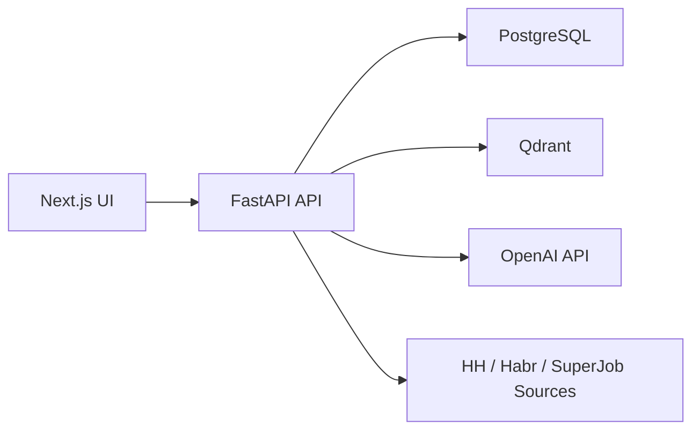

# HR-Assist — AI-ассистент для соискателей

> Загружаешь резюме — получаешь отранжированный список вакансий, честный разбор «чего хватает» и «чего нет», и воронку откликов без ручной рутины.

**Конкурирует с:** hh.ru Premium · карьерные коучи · getmatch

> Английская версия: [README.md](README.md).

## Что умеет

| Фича | Детали |
|---|---|
| **AI-подбор вакансий** | Семантический поиск по Qdrant — по смыслу резюме, не по ключевым словам. 8-стадийный матчер с MMR-разнообразием и объяснением «Почему показали». |
| **Анализ резюме** | LLM разбирает PDF/DOCX: роль, грейд, опыт, hard/soft skills, домены, сильные стороны, зоны роста, риски, рекомендации. |
| **Трекер откликов** | Kanban-доска: Откликнулся → Ответили → Пригласили → Отказали. Вакансии с откликами не дублируются в подборе. |
| **AI cover letter** | Генерация и редактирование сопроводительного письма прямо в карточке отклика. |
| **Профиль предпочтений** | Формат работы, переезд, должности, зарплата — учитываются в подборе. Decay-взвешенный: старый фидбэк затухает. |
| **Decay-профиль** | Лайки/дизлайки взвешены по времени через экспоненциальный decay — свежий фидбэк весит больше. |
| **Панель администратора** | Управление пользователями, флаг is_admin, техническая статистика. |

## Архитектура



Подробности: [docs/ARCHITECTURE.md](docs/ARCHITECTURE.md)

## Быстрый старт

1. Скопируйте env:

```powershell
Copy-Item .env.example .env.local
```

2. Заполните минимум в `.env.local`:

```env
OPENAI_API_KEY=sk-...
JWT_SECRET_KEY=replace-with-strong-secret
BETA_TESTER_KEYS=your-beta-key-1,your-beta-key-2
AUTH_EMAIL_DELIVERY_MODE=console
```

3. Запустите сервисы:

```powershell
docker compose up -d --build
```

4. Откройте:

- UI: [http://localhost:3000](http://localhost:3000)
- API docs: [http://localhost:8000/docs](http://localhost:8000/docs)
- Health: [http://localhost:8000/health](http://localhost:8000/health)
- Qdrant: [http://localhost:6333/dashboard](http://localhost:6333/dashboard)

## Как работает вход

1. Регистрация: email + пароль + beta-key.
2. Подтверждение email одноразовым кодом.
3. Вход: `login/start` (email+пароль), затем `login/verify` (код+challenge).
4. Защищенные API доступны только после подтверждения email.

## Ключевые переменные окружения

Полный список: [.env.example](.env.example)

- `OPENAI_API_KEY` — ключ OpenAI.
- `OPENAI_ANALYSIS_MODEL` — модель анализа резюме/вакансий.
- `OPENAI_MATCHING_MODEL` — модель детального matching.
- `JWT_SECRET_KEY` — секрет подписи JWT.
- `BETA_TESTER_KEYS` — список разрешенных ключей бета-тестеров.
- `AUTH_EMAIL_DELIVERY_MODE` — `console` для локалки, `smtp` для прода.
- `DATABASE_URL` — подключение к PostgreSQL.
- `QDRANT_URL` — адрес Qdrant.

## Безопасность

- Не коммитьте `.env.local`.
- Не храните реальные токены/секреты в репозитории.
- Для production используйте только SMTP-режим отправки кодов.
- Пожалуйста, сообщайте уязвимости приватно: [SECURITY.md](SECURITY.md)

## Планы развития

Полный публичный roadmap: [docs/ROADMAP.md](docs/ROADMAP.md).

Недавние релизы:

- `v0.13.0` — Phase 5.1 (Track segmentation + gap analysis): подбор разложен на 3 трека — **точка** (match), **вырост** (grow), **стрейч** (stretch). Detereministic `track_classifier` (без LLM) по `vector_score / seniority_diff / skills_overlap`; `track_gap_analysis` агрегирует top-5 missing skills per track + `softer_subset_count`. Главная переверстана в 3 collapsible-секции с editorial 3px-rule treatment (match=neutral, grow=blue, stretch=amber). Новый endpoint `GET /api/resumes/{id}/track-gaps`, кэш 24h в `track_gap_analyses` (миграция 0031), `track` в `resume_vacancy_scores` (0030) и в `applications` (0032 — apply-rate-by-track funnel). Telemetry-events `track_section_expanded` / `track_gap_clicked` / `softer_subset_clicked` / `apply_from_track` через новый `POST /api/telemetry/event`. 32 новых теста, 584/584 backend tests green.
- `v0.12.1` — Phase 5.0.1 (Audit data pipe fixes): `/audit` перестал быть пустой заготовкой — `_build_skill_gaps` теперь читает `must_have_skills` (canonical-ключ из `vacancy_analyzer`, до этого падал в `or []` на всех ~825 продакшен-вакансиях); `_build_market_salary` получил fallback на `salary_baseline.get_baseline_band()` (median-by-role) когда LightGBM не обучен — `model_version="baseline-median-v1"`; `sample_size` теперь честно считает bucket по `role_family+seniority`, а не все vacancy_profiles.
- `v0.12.0` — Phase 5.0 (Market-grounded resume audit + light Q&A onboarding): новая страница `/audit` с 4 блоками — как мы прочитали резюме (role_family, seniority, alt-роли), ожидаемая зарплатная вилка, топ-5 skill gaps от рынка, проблемы качества резюме (правила); 30 IT-специфичных вопросов в `onboarding_templates.yaml` с trigger-условиями (AND/OR/NOT precedence), детерминированные правила по дефолту, LLM-классификатор за флагом с PII-scrubber'ом; cost cap $0.05/DAU/день с template-mode fallback; 7-day cache в `resume_audits` (prompt_version=`audit-v1`); admin: `cost_p95_per_dau_usd` + `GET /api/admin/audits/sample`; eval-bootstrap: 20 self-labeled fixtures + LLM-judge regression-CI.
- `v0.11.0` — Phase 4.3 (Warm-run widening + best-of-market fallback): подбор больше не теряет «лучшую работу из исторических» — deep-scan повторяется с `date_from=None` когда не набирается high-quality target. Бюджеты warm-run расширены (analyzed 18→50, deep queries 3→6, match_limit 20→40). Фронт: 10 + кнопка «Показать ещё», честный заголовок «Подобрали лучших: N».
- `v0.8.1` — Полный редизайн интерфейса + трекер откликов + исправления (2026-04-23): новая дизайн-система Tailwind v4 + shadcn/ui с 10 темами и семантическими токенами; все UI-компоненты (Button, Card, Badge, Collapsible, Dialog, Input, Topbar) переписаны с нуля; новые страницы `/applications` (Kanban-трекер), `/admin`, `/vacancies`, `/resume-analysis`, `/funnel`, `/about`, `/contacts`, правовые страницы; главная страница полностью переработана — двухколоночный workspace, sticky-сайдбар с профилем, автоанализ резюме при загрузке, линейный flow подбора; decay-взвешенный профиль предпочтений; исправлено дублирование вакансий с откликами в подборе; полировка UX (убраны разделители, компактные отступы, кнопка Свернуть в анализе, нормальный вес шрифта в полях ввода).

- `v0.8.0` — Phase 2.8 (Serious product polish): auth-ошибки перестали рендериться как `[object Object]`; Tailwind v4 + shadcn фундамент с refined-editorial дизайн-системой (Fraunces + Source Sans 3, cream canvas + cardinal red, WCAG AA/AAA); `users.is_admin` + `/admin` роут с технической статистикой, в сайдбаре юзера — честная воронка (проанализировано / отобрано / последний поиск / следующее обновление); роут-сплит `/`, `/applications`, `/admin` с глобальным Topbar + переключателем профилей; главный поток линейный — автоанализ при загрузке, компактная карточка профиля из 4 строк, один блок «Что ищу», одна CTA «Искать вакансии» + заголовок результатов «Топ-N из M просмотренных»; курация скиллов / отобранные / отклонённые / детали профиля — свернуты по умолчанию; Kanban откликов переверстан на 4 колонки с архивом под toggle и notes-редактором в свёрнутой секции карточки; дизайн-проход на всех трёх экранах с оркестрованной fade-reveal и `prefers-reduced-motion` guard.
- `v0.7.0` — Phase 2.1–2.7 (Matching quality overhaul): шумовой гейт против кросс-доменных залётчиков; eval-харнесс на 148 gold-парах с NDCG/MAP/MRR-флорами в CI; матчер разобран на 8 стадий + MMR для разнообразия; ESCO-классификатор ролей с хард-дропом tech→non-tech; cross-encoder/LLM-rerank с блоком «Почему показали» на карточке; impression/click/dwell-телеметрия; скелет зарплатного fit — поле «Ожидаемая зарплата» в профиле и бейдж зарплаты на карточке (предсказатель пока спит до роста корпуса).
- `v0.6.0` — Phase 2.0 (First-run rescue): холодный индекс расширен 18 → 40 вакансий; параллельный HH-fetch и LLM-parse ускорили подбор в 2-3×; выдача разделилась на `strong` + `maybe` два уровня, доменный гейт перестал дропать кросс-домен в ноль; три кнопки подбора схлопнулись в одну «Обновить подбор», а «Background warmup» из 12 технических строк стал человеческим «Следующее обновление через MM:SS».
- `v0.5.0` — Phase 1.9 (Freshness + accuracy + agency): HH-cursor, чтобы каждое «Обновить подбор» приносило свежее, а не повторяло старое; quant-детектор «от N лет» и RU↔EN skill-таксономия, чтобы «не хватает» не врал на навыках, которые у юзера есть; микро-кнопки ✓/✗ на карточке вакансии для прямого user-override.
- `v0.4.0` — Phase 1.8 (Matching relevance hardening): доменный гейт IT ↔ non-IT до хард-фильтров, строгое разделение hard/soft полей в bag-of-words, поднятый `MIN_RELEVANCE_SCORE`. Сеньорное IT-резюме больше не ловит стройку, авто и юристов из-за общих русских слов.
- `v0.3.0` — Phase 1.7 (Matching quality + multi-profile): skill-overlap floor, штраф за грейд, обновлённый title boost, гигиена индекса, time-decay предпочтений, до 2 профилей-резюме с изолированным фидбэком и бейджами на Kanban.
- `v0.2.0` — Phase 1 (Actionability): предпочтения при поиске, объяснение совпадений, трекер откликов, AI-сопроводительные, отмена подбора.
- `v0.1.0` — Phase 0 (Foundation): бюджет-гард на OpenAI, структурные логи, rate-limit на auth, SMTP-доставка кодов.

> Версия намеренно меньше 1.0 — продукт в закрытой бете, публичный запуск состоится позже.

## Вклад в проект

Правила для контрибьюторов: [CONTRIBUTING.md](CONTRIBUTING.md)
